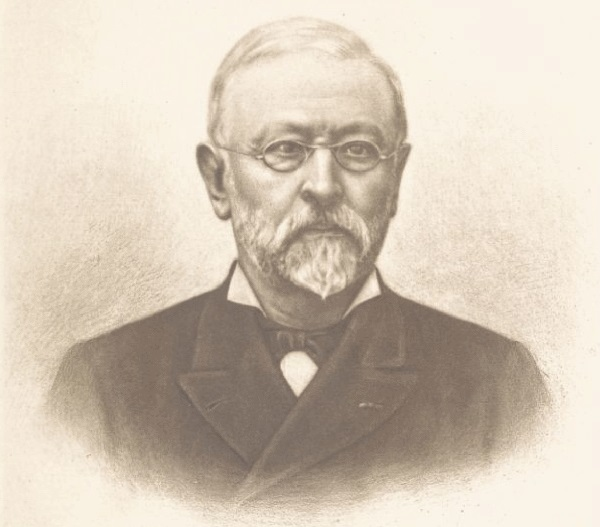

<!DOCTYPE html>
<html lang="{{ lang }}">

<head>
<meta charset="utf-8">
<meta http-equiv="X-UA-Compatible" content="IE=edge">
<meta name="viewport" content="width=device-width, initial-scale=1">
<title>Albin Mazon et son o|euvre - {{ sitetitle }}</title>
<meta name="description" content="{{ description }}">
<link rel="shortcut icon" href="./favicon.ico">
<link rel="apple-touch-icon" href="./apple-touch-icon-180x180.png">
<link rel="stylesheet" href="./css/normalize.css">
<link rel="stylesheet" href="./css/style.css">
</head>

<body id="mazon" class="oeuvre">

<header>
<h2><a href="/">{{ title }}</a></h2>
<h5>{{ alttitle }}</h5>

</header>

M. Charles-Albin Mazon naquit à Largentière, le 20 octobre
1828, d'une ancienne famille originaire d'Antraïgues ([1](#notes)). Son
père, le docteur Louis-Victorin Mazon ([2](#notes)), vint s'établir à
Largentière en 1824 et y exerça la médecine pendant de longues
années. Son aïeul avait été receveur particulier dans la même
ville ([3](#notes)). M. Albin Mazon fit ses études au collège de Privas,
alors dirigé par les Basiliens, et conserva de leur enseignement
un souvenir reconnaissant qu'il se plaisait à rappeler. En 1855 il
était rédacteur en chef de l'_Avenir de Nice_, journal dans lequel il
mena une campagne active en faveur de l'annexion à la France,
campagne qui le fit expulser en 1861 par les autorités italiennes,
et lui mérita la croix de la Légion d'honneur, qu'il reçut le 15
août 1862. Il vint à Paris après son expulsion et fut nommé
directeur des services télégraphiques à l'agence Havas, fonctions
absorbantes et délicates qu'il occupa pendant près de trente ans.
Il donna sa démission au mois d'octobre 1890 et se consacra
désormais aux travaux d'histoire locale qui occupaient déjà ses rares
loisirs depuis une vingtaine d'années. Il travaillait encore pendant
la cruelle maladie qui devait l'emporter. Après ses enfants
qu'il aimait tendrement, l'objet de ses dernières pensées fut le pays
qu'il a servi, la plume à la main, pendant près d'un demi-siècle.
Il est mort en chrétien, le 29 février 1908 et repose à Privas, au
coeur de ce vieux Vivarais qu'il a tant aimé.

Depuis 1870 M. Mazon a publié un nombre considérable d'articles,
de brochures ou de volumes : nous en avons relevé plus de
cent cinquante dans la bibliographie, certainement incomplète,
qu'on trouvera plus loin. Peu d'historiens ont fait preuve d'une
telle fécondité ; mais, pour se bien rendre compte du mérite
qu'eut M. Mazon à manifester une telle puissance de travail, il
faut se rappeler dans quelles circonstances il parvint à recueillir
la prodigieuse quantité de documents dont il tira ses publications :
sa situation à l'agence Havas ne lui laissait que peu de loisirs et
ne lui ménageait pas les soucis ; il lui fallut, pour triompher de
ces difficultés, une rare lucidité d'esprit jointe à une extraordinaire
activité ; il fut encore soutenu, sans doute, par l'affection
passionnée qu'il gardait à son pays natal.

C'est dans cet amour de la petite patrie qu'il trouva l'idée première
de son oeuvre : vulgariser l'histoire du Vivarais. Il commença
dans ce but une série de **[Voyages](/)**, où il abordait tous les
sujets et les mettait à la portée de tous. Ces publications furent
bien accueillies et l'on peut dire que le nom du docteur Francus,
sous lequel parurent ces volumes, est presque devenu populaire
en Ardèche. M. Mazon fut dans ces voyages, où il vantait les
beautés méconnues du Vivarais et mettait en lumière ses ressources
inutilisées, comme le précurseur des Syndicats d'Initiative
qui font tant, aujourd'hui, pour la prospérité du département.
Il fit paraître successivement treize volumes, où la partie
historique augmentait constamment en importance et en autorité ;
cette collection tient une place à part dans l'oeuvre de M. Mazon
et constitue un ensemble aussi original qu'utile.

Plus tard, à mesure que s'augmentaient ses notes et que ses
vues sur l'histoire du pays devenaient plus profondes et plus
précises, M. Mazon aborda des travaux d'une érudition plus serrée ;
à un âge où d'autres n'auraient aspiré qu'à jouir d'un repos bien
gagné, il redoubla d'activité et entreprit une série d'ouvrages où
il ressuscita bien des figures de Vivarois injustement oubliés, où
il retraça le passé des principales villes du pays et où il étudia
les périodes les plus mouvementées de l'histoire du Vivarais.
Dans cette seconde partie de son oeuvre il eut soin de s'entourer
de tous les renseignements qui pouvaient lui être utiles. Les
archives publiques et privées du département n'avaient plus de
secrets pour lui ; il sut encore extraire des minutes de notaires bien
des documents curieux, négligés jusqu'alors ; et surtout il fut le
premier qui comprit tout ce qu'un historien provincial peut recueillir
dans les grandes bibliothèques et les dépôts d'archives de Paris.
Assidu à la Bibliothèque et aux Archives nationales il dépouilla
le fonds peu exploré des Archives du Ministère des Affaires
étrangères, et il avait même fait, avant la guerre de fructueuses
recherches à la Bibliothèque du Louvre, qui fut brûlée pendant
la Commune. C'est à cette étude complète de toutes les sources
de notre histoire locale que tient en partie la supériorité de son
oeuvre : il a su choisir les meilleurs matériaux et les découvrir
partout où ils se cachaient, mais mieux encore il a su les mettre
en oeuvre : il arrivait à résoudre les difficultés avec une élégante
clarté, et il avait le don de présenter sous une forme agréable le
résultat des plus arides recherches, gardant pour lui la peine et
laissant au lecteur le plaisir et l'intérêt sans lui laisser soupçonner
l'effort qui lui avait été nécessaire.

Il faut dire encore quelques mots d'une oeuvre dont l'honneur
doit être reporté en grande partie à M. Mazon : la _Revue du
Vivarais_, fondée en 1893 par M. Paul d'Albigny. M. Mazon en
fut l'un des promoteurs, et l'on peut dire qu'il en fut l'âme. Il
voyait dans le groupe d'écrivains qui en constituent la rédaction
comme ses continuateurs ; il ne leur ménageait ni sa bienveillance
ni ses conseils, et il n'est pas un d'entre eux qui n'ait eu à
se louer de son inépuisable obligeance. Ils se considéraient un
peu comme ses élèves et l'entouraient d'une respectueuse affection.
En donnant à la _Revue du Vivarais_ une collaboration de
tous les instants M. Mazon a contribué largement au succès de
cette entreprise désintéressée, dont la réussite paraissait
douteuse dans un département aussi pauvre, et cette sollicitude,
qu'il lui a témoignée jusque dans les derniers jours, lui doit être
un autre titre à la reconnaissance de ses compatriotes.

Pour se faire une idée exacte de l'oeuvre de M. Mazon, il faut
l'étudier d'un peu près, et dans son ensemble. Si plusieurs de
ses travaux se recommandent particulièrement par l'intérêt ou la
nouveauté du sujet, par la forme plus soignée, ou par l'importance
des recherches, toutes ses publications sont solidaires. Il
est fréquemment revenu sur les mêmes questions lorsque des
documents nouveaux pouvaient les éclairer, et tous ses ouvrages
ne sont pas loin de former, en fait, l'Encyclopédie de l'Ardèche
qu'il avait rêvé d'écrire.

---

Faire connaître et aimer son pays, tel est le but que s'était
d'abord proposé M. Mazon. Dans cette pensée, il entreprit
comme nous l'avons dit une série de _Voyages_ en Vivarais, commencée
en 1878 et qu'il poursuivit jusqu'à la fin de sa vie.
Historien, géologue, naturaliste et philosophe, il aborda tous les
sujets, s'attachant à instruire et à moraliser, sans ennuyer. Il
avait été romancier à ses heures, et s'en souvint en écrivant ces
voyages, qui sont constamment d'une lecture agréable, et surent
captiver le public, peu préparé, auquel il les destinait.

A l'apparition de ces premiers volumes certains critiques firent
à l'auteur le reproche de toucher aux questions politiques ; il s'en
défendit avec raison, déclarant qu'il n'appartenait à aucun parti
et que son indépendance lui permettait de distribuer équitablement
le louange ou le blâme. Il aurait pu ajouter que ses fonctions
à l'agence Havas l'avaient mis en rapport pendant de
longues années avec tous les hommes qui se sont succédés aux
affaires, et qu'il avait tiré de ce contact journalier avec des
hommes d'état d'origine et d'opinion différentes une expérience
qui le mettait mieux que d'autres à même de juger impartialement
ses contemporains. Sa franchise le priva d'encouragements,
que d'ailleurs il ne recherchait point, et lui valut de n'être pas
l'historiographe officiel du Vivarais : son oeuvre n'en a que plus
de valeur.

Quelques lecteurs ont regretté la forme anecdotique qu'il
donnait à ses premiers livres et auraient préféré qu'il ne se
départît point du ton sévère qu'ils jugaient convenir à un historien.
M. Mazon leur réservait une ample satisfaction dans
d'autres ouvrages, mais il voulait être d'abord un vulgarisateur,
et il avait choisi pour y réussir une forme dénuée de prétention.
Il avait vu juste puisque le public fit bon accueil à ses livres ([4](#notes))
et que des notions et le goût de l'histoire locale ont génétré grâce
à lui dans des milieux relativement peu lettrés. Il a d'ailleurs
distribué lui-même avec générosité un grand nombre de livres ;
beaucoup d'écoles ont bénéficié de son désintéressement et il a
pu, autant qu'il lui était possible, remédier ainsi à une lacune de
l'enseignement public. Il faut lire ces Voyages pour y goûter la
verve très personnelle de M. Mazon, son humour méridionale et
la forme presque primesautière qu'il savait donner à des réflexions
si profondément sensées. Des juges d'une haute compétence ([5](#notes))
appréciaient à leur valeur ces ouvrages de M. Mazon et l'extraordinaire
variété des documents qu'il avait su découvrir.

On relira longtemps ces Voyages pour y chercher une utile
récréation, mais nous voudrions montrer aussi, en les passant
rapidement en revue, que les érudits peuvent y recueillir des
documents précis qui ne se trouvent pas ailleurs. A considérer
cette série dans son ensemble on s'aperçoit qu'elle forme un tout
solide, et qu'une table générale en ferait presque un dictionnaire
topographique et biographique de l'Ardèche.

Le **[Voyage aux pays volcaniques du Vivarais](./vivarais/)**, comme les
premiers volumes de cette série, est plus anecnotique qu'historique ;
c'est la nature qui en a fixé l'itinéraire, d'un volcan à
un autre, depuis le Chenavari jusqu'à Antraïgues et Montpezat.
La géologie y tient comme de juste une grande place ; un chapitre
y est consacré à J.-B. Dalmas, géologue de mérite ; d'autres aux
eaux minérales du Vernet, de Neyrac et de Marcols, et à la
question du reboisement. On y trouve, à propos du château de
Pourcheyrolles, un très juste éloge des paysages vivarois, appuyé
par une flatteuse citation du géologue anglais Poulett Scrope.
Arrivant à Antraïgues, l'auteur recueille quelques notes d'histoire
contemporaine sur le pèlerinage de Saint-Roch, et la
communauté des soeurs garde-malades de St-Roch, et aussi sur
un défenseur ignoré de Louis XVI, Louis Mazon, son grand père,
dont il raconte brièvement la courageuse initiative.

Le **[Voyage autour de Valgorge](./valgorge/)** ne diffère pas sensiblement,
comme composition, du précédent. L'auteur y fixe quelques
renseignements conservés depuis un siècle par la tradition,
comme la rivalité des habitants de Saint-Mélany et de Sablières
et la réconciliation solennelle qui fut ménagée entre eux par
leurs prieurs. Il faut citer parmi les descriptions celle du donjon
de Montréal, et des notes biographiques sur les La Fare et sur
Ovide de Valgorge.

Le **[Voyage autour de Privas](./privas/)** marque une orientation
nouvelle vers les questions d'histoire locale. M. Mazon y utilise
la Collection de Languedoc, formée par les Bénédictions, et
dans laquelle il avait remarqué la correspondance du marquis
de Jovyac, qui forme une véritable chronique de la bonne société
vivaroise au XVIII^e^ siècle. Le livre du géologue italien Marzari-Pencati
lui a encore fourni des notes très vivantes. Chemin
faisant l'auteur traite de petits sujets d'histoire locale, comme le
pélerinage de Pramailhet et la fontaine de Boulègue, dans des
chapitres qui sont des monographies très complètes. On trouve,
dans la suite du volume, tout ce qu'il faut savoir sur des notabilités
ardéchoises comme Delichères, les frères Allignol, le
général Massol ou les Hilaire de Jovyac. Pour Privas même,
dont l'histoire a été un peu négligée, un dernier chapitre donne
une suite de notes chronologiques et le récit documenté des
démêlés qui se produisirent sous Napoléon I^er^ pour le maintien
de la préfecture à Privas.

Deux ans plus tard paraissait le **[Voyage dans le midi de
l'Ardèche](./midi-ardeche/)**, consacré aux cantons de Joyeuse, des Vans et de
Vallon. Un historique des pélerinages de Chapias, de la
Blachère et de Cornillon, des notes sur l'hermitage de Saint-Eugène,
sur le P. Nicolas, curé de la Rochelle, sur l'abbé de la
Salle, qui fit un séjour aux Vans, enfin, pour Rosière, le procès-verbal
de la visite de l'église, en 1675, par M. Monge, vicaire
général, donnent une large place dans ce volume à l'histoire
religieuse. Celle des familles n'y est pas moins bien représentée.
M. Mazon ne s'est jamais attaché au point de vue purement
généalogique et nobiliaire dans les études qu'il a consacrées aux
familles du Vivarais : il les a plutôt considérées au point de vue
du rôle historique qu'elles ont joué dans le pays. C'est ainsi qu'il
a cité les Barthélemy de la Forest, famille de Joyeuse qui eut
son heure d'éclat, et dont il raconte la misérable fin. Un chapitre
entier est consacré aux Chanaleilles et à leur généalogie, dressée
d'après les manuscrits de l'abbé Chambron, généalogie sur
laquelle M. Mazon, mieux averti, devait plus tard faire des
réserves, mettant même en doute l'existence de l'abbé Chambron.
(_Notice sur Jaujac_, p. 281.) Un autre chapitre retrace l'histoire
de la famille considérable des Merle de Lagorce, et le dernier
constitue la bio-bibliographie la plus complète, croyons-nous, de M.
Eugène Villard, de Vallon.

Le **[Voyage le long de la rivière d'Ardèche](./riviere-ardeche/)** est peut-être
le plus vivant de la série. Les documents qui s'y mêlent aux
légendes n'ont rien de rébarbatif. Quelques notes sur la famille,
le prieuré et l'hermitage d'Ucel, amènent l'auteur a parler de feu
M. Henry Deydier, dont l'oeuvre historique et généalogique, bien
que demeurée manuscrite, mérite d'être citée. A propos d'Aubenas,
il réfute une légende mise en circulation par Ovide de
Valgorge, et d'après laquelle la terre d'Aubenas serait échue à la
famille de Vogüé à la suite d'un heureux coup de dés, légende
erronée s'il en fut, qui a fait une grande fortune, et que l'on voit
reparaître de temps en temps sous la plume d'auteurs plus
soucieux du détail pittoresque que de la vérité historique. D'Aubenas,
M. Mazon passe à Vogüé où il présente aux lecteurs une
dynastie de rois d'Yvetot, les Tastevin, dont la bonne popularité
méritait d'être signalée. A propos de Balazuc l'auteur risque la
gauloise légende de Jacqueline de Borne. Un chapitre est consacré
au cardinal de Bernis, et un autre à Madame Vierne de
Baladun, bienfaitrice de Bourg-Saint-Andéol, identifiée avec une
Balazuc.

Le **[Voyage au pays helvien](./helvien/)** est limité à la région qui
s'étend entre Viviers et Largentière. On y trouve d'intéressants
détails sur la topographie de Villeneuve de Berg et sur ses usages
locaux. Le volume entier contient un assez grand nombre de
biographies de notables Vivarois : Jean de Serres, Antoine Court
et Court de Gébelin, les Barruel, J. L. de Laboissière, S. P. de
Tavernol, l'abbé Feuillade, le chanoine Rouchier, Jacques de
Bane, Jacques et Marie de Romieu, Honoré Flaugergues, l'abbé
Barracand, et surtout le vicomte de Saint-Andéol, archéologue
dont M. Mazon énumère et apprécie l'oeuvre, et le président
Challamel. Celui-ci, né en 1763, n'a laissé que des manuscrits
inédits ; son érudition a sensiblement vieilli, et cette constatation
n'enlève rien à son mérite. L'auteur analyse ses oeuvres et
reproduit son opinion sur l'origine des Etats de Vivarais,
opinion intéressante, ingénieuse et peu fondée que M. Mazon
devait contredire lui-mème, aprés avoir étudié le sujet, dans son
_Essai sur le Vivarais pendant la guerre de cent ans_ (pp. 292, 301).

Le **[Voyage au Bourg-Saint-Andéol](./bourg-st-andeol/)** avec des détails de
moeurs et des souvenirs pittoresques, comme le récit d'un voyage
fait en bâteau par l'auteur, du Pont-Saint-Esprit au Bourg-Saint-Andéol,
vers 1840, contient des notices qui restent à
consulter sur des Vivarois peu connus du XVII^e^ et du XVIII^e^
siècle, comme le médecin Combalusier, né en 1713, qui professa
la pharmacie à Paris, et Jacques Mosnier, juriste, qui publia en
1618 sous le titre de _Véritables alliances du droit français_ un
recueil qui ne mérite pas l'oubli dans lequel il est tombé. Plus
près de nous, l'auteur fixe les silhouettes d'Henri d'Audigier,
publiciste aimable et distingué, et de l'abbé Chiron, aumônier
des prisons de Privas, qui laissa une mémoire vénérée.

Le **[Voyage autour de Crussol](./crussol/)** conduit pour la première
fois le lecteur dans le Haut-Vivarais. M. Mazon y donne au
début d'intéressantes indications sur sa méthode de travail et sur
les publications qu'il projetait. Comme dans les volumes précédents
on y trouve quelques biographies : celle de M. Dode,
député aux Etats généraux, et de l'abbé Garnodier, historien ;
des détails de moeurs comme la description du jeu de la "Surle"
qui fleurit à Charmes depuis des siècles, sur les Crussol, et les
mémoires de M. de Villeneuve La-Roche-Barnaud, de Saint-Péray,
émigré et échappé aux massacres de Quiberon ; mais il
faut y signaler surtout un important chapitre sur les anciennes
divisions administratives du Vivarais.

Le **[Voyage au Mont-Pilat](./pilat/)** n'a presque rien de vivarois,
c'est surtout en naturaliste et en philosophe que M. Mazon a
parcouru cette région du Forez ; il donne cependant une note
sur Jean Bruzeau, fondateur de la communauté des hermites de
Saint-Montan, et quelques renseignements sur les origines de
l'industrie de la soie en Vivarais.

Le **[Voyage à travers l'Ardèche et la Haute-Loire](./haute-loire/)**,
plus rapide que les précédents, est aussi plus anecdotique, on
y trouve cependant des détails sur de pieux personnages nés dans
la montagne ardéchoise : la mère Rivier et l'abbé Chiron (déjà
cités dans le _Voyage au Bourg-Saint-Andéol_), l'abbé Terme et la
soeur Térèse Couderc. Chemin faisant, M. Mazon rectifie encore
une légende : celle de Madame de Rochebonne, l'amie de
madame de Sévigné, et de ses prétendus séjours en Vivarais.

Le **[Voyage autour d'Annonay](./annonay/)**, débute par un résumé,
clair et complet, de l'histoire des papeteries. Les biographies y
tiennent une grande place : on y trouve une note précieuse sur
les Pagan, dont l'histoire fut si controversée ; d'autres sur les
Montchal, les Ruolz, les Vocance, et, pour l'époque contemporaine,
sur M. Rouveure, le peintre Henri Gard, Mgr Roche, et
l'abbé Caillet, historien de mérite. Deux chapitres sont presque
exclusivement archéologiques : l'un traite du Châtelet d'Andance,
ancien temple romain ; l'autre de la Sarrasinière,
autre monument romain, sur lequel on a beaucoup discuté.
L'auteur résume d'une façon brève et substantielle tout ce qui
a été écrit à ce sujet.

Le **[Voyage au pays des Boutières](./boutieres/)** est certainement l'un
des plus intéressants de la série. Il est consacré à "la partie de
nos montagnes où sont le mieux conservées les traditions huguenotes".
L'auteur a utilisé pour ce volume les sources les plus
variées : il y traite presque exclusivement l'histoire de Vernoux,
de Châteauneuf et de Chalancon, aux dix-septième et dix-huitième
siècles. Il va même jusqu'à la période contemporaine et
donne le texte du beau discours prononcé le 3 juin 1888 par un
notable protestant des Boutières, M. Vacheresse, propriétaire de
l'école libre de Cluac. De rapides biographies signalent les principaux
personnages originaires de Vernoux.

Le **[Voyage dans le Haut-Vivarais](./haut-vivarais)** clôture cette suite de
récits agréables et instructifs : il est consacré à Saint-Agrève, la
Louvesc et Devesset. Parmi les biographies qui y figurent, il
faut retenir celle du général Combelle, soldat brillant, injustement
oublié.

Le Docteur Francus avait ainsi parcouru tout le département,
la mort l'a empêché de rédiger les notes qu'il avait recueillies
sur Antraigues et ses environs ; elles seront publiées prochainement.

---

M. Mazon a fait des recherches sur un assez grand nombre
de Vivarois notables ; il ne s'est pas attaché à retracer la vie et
à étudier les oeuvres de ceux qui sont au premier rang parmi les
célébrités de leur temps, comme Olivier de Serres ou le Cardinal
de Bernis, mais il a remis dans leur jour des physionomies oubliées
et leur a rendu leur véritable place au nombre des Vivarois
dignes de mémoire. Toute cette partie de l'oeuvre de M.
Mazon possède, entre autres mérites, celui de la nouveauté.

La légendaire Clotilde de Surville lui a fourni le sujet d'un
de ses premiers volumes, plaquette élégante comme il convenait
à cette gracieuse figure. Clotilde de Surville, ou plutôt **Marguerite
Chalis**, femme de Bérenger de Surville, n'était connue
que par ce qu'apprenaient d'elle les poésies charmantes
publiées sous son nom. M. Mazon eut communication de l'acte
de mariage de Bérenger de Surville, et en publia le texte latin
et la traduction française ; il y joignit quelques documents nouveaux,
les critiqua et conclut, que "s'il reste simplement probable
que les poésies de Clotilde sont l'oeuvre d'un membre de
la famille de Surville, elles ne peuvent pas être de la personne
qu'on a voulu désigner sous le nom de Clotilde de Surville, et
que leur date est de beaucoup postérieure au XV^e^ siècle". Il
écrivait ces lignes en 1873, et tous les travaux parus depuis n'ont
fait que confirmer ses conclusions. On ne peut dire, d'ailleurs,
qu'elles dépouillent absolument le Vivarais d'une de ses petites
gloires, et il faut probablement attendre du hasard le document
décisif. M, Mazon ne perdit pas de vue, dans la suite, la question
Surville. Neuf ans plus tard (_Voyage dans le Midi de l'Ardèche_,
1884, pp. 396-398) il établissait que Bérenger de Surville,
mort, suivant les poésies, au siège d'Orléans, en 1429, vivait
encore en 1430, 1434 et 1459. L'_Essai sur le Vivarais pendant la
guerre de cent ans_ (1898) contenait encore quelques détails sur la
question. Le débat n'est pas clos puisque l'auteur des poésies
n'est pas connu, mais M. Mazon a été le premier à renforcer par
des documents l'opinion des philologues et des littérateurs.

**Bon Broé, de Tournon** (1523-1588) était bien oublié : la brochure
que M. Mazon lui a consacrée est une véritable résurrection
de ce personnage, de sa famille, et de son milieu. Il
fallait connaître le seizième siècle vivarois comme M. Mazon
pour arriver à recueillir, partout où ils se cachaient, les
documents qui lui ont servi a établir cette biographie. Bon Broé,
fils d'un greffier des Etats de Vivarais, était l'oncle de Jacques
de Serres, qui devint évêque du Puy, et probablement le cousin-germain
du poète Pierre Broé. Sa mère était soeur de Pierre de
Villars, archevêque de Vienne, grand-oncle du maréchal. Bon
Broé appartenait donc à une de ces familles de haute bourgeoisie
qui trouvèrent dans les charges de l'administration diocésaine,
comme les Astars, les Nicolay et les Serres, le premier échelon
d'une grande fortune. La protection du cardinal de Tournon
facilita les débuts de Bon Broé ; nommé conseiller au parlement
de Paris, il sut faire apprécier à la cour sa sagesse et son intégrité.
M. Mazon nous retrace sa carrière et les missions dont il
fut chargé en Italie ; il consacre deux chapitres au testament de
ce bon vivarois et à la fondation du séminaire Broé, et un chapitre
à la descendance de sa famille. Cet ouvrage est une juste
réparation faite à la mémoire d'un homme considérable qui fut
un homme de bien, et il est aussi, au point de vue de la documentation,
et de l'habileté avec laquelle des textes variés et
d'apparence aride sont mis en oeuvre, un modèle de biographie.

**Achille Gamon**, chroniqueur, et **Cristophle de Gamon**,
poète, son fils, doivent à M. Mazon une étude (augmentée
d'un appendice en 1894 et de notes complémentaires parues dans
la _Revue du Vivarais_ en 1907) qu'on peut considérer comme définitive
au point de vue historique, bibliographique et littéraire.
Achille Gamon est l'auteur d'une chronique sur les troubles du
seizième siècle, où il s'est montré si modéré dans ses jugements
que les auteurs n'ont pas tous été d'accord sur la religion : Dom
Vaissette et les frères Haag le croyaient catholique, Poncer a
prouvé le premier qu'il était huguenot. M. Mazon éclaire sa vie
de notes tirées de son livre de raison.

Christophle de Gamon, son fils, fut un vrai poète. M. Mazon
le compare aux autres poètes fournis par le Vivarais. "Bérenger
de la Tour, d'Aubenas, Jacques et Marie de Romieu, et, à une
époque moins éloignée, le marquis de la Fare, le cardinal de
Bernis, Boissy d'Anglas, se recommandent par des qualités aimables
ou sérieuses, mais aucun d'eux n'a, du moins au même
degré que Gamon, ce sentiment des grandes choses, cette préoccupation
constante des vérités supérieures, cette originalité d'expression,
ce feu sacré, ou, si l'on aime mieux, ce diable au corps
qui constituent le poète, et qui, malgré mille défauts, animent
l'oeuvre entière de Gamon". Il faut reconnaître à Gamon "trois
qualités rares qui sont : la généralité des connaissances, l'élévation
de l'esprit et l'ardeur des convictions religieuses". M. Mazon
conclut en disant que toutes ces qualités doivent assurer à Gamon
"un des premiers rangs parmi les illustrations du Vivarais
et un rang honorable dans la littérature française". Conclusion
certainement élogieuse, mais dont on s'explique le bien fondé
après avoir parcouru le volume de M. Mazon, si touffu, si varié
et si substantiel.

Dans **les deux Bérenger de la Tour, d'Aubenas**, M. Mazon
traite une question très obscure dont on ne paraissait pas,
avant lui, avoir soupçonné la difficulté. Après s'être entouré
de tous les documents connus, auxquels il en ajoute d'inédits,
extrêmement précieux, après "avoir déblayé le terrain" il
amène la question au point que sa solution ne dépend plus que
d'un hasard, qui mettra au jour "la pièce décisive". En
attendant M. Mazon a donné de Béranger de la Tour, l'avocat,
une biographie très nouvelle où l'on voit l'importance du rôle
qu'il joua dans le parti des protestants modérés, et où l'on
apprend que cet avocat fut aussi un historien, et même un précurseur
quisqu'il écrivit une histoire du Vivarais, à peu près
terminée en 1594. M. Mazon étudie l'oeuvre de Bérenger de la
Tour, le poète, et relève un certain nombre d'erreurs notoires
dans sa généalogie, dressée par feu M. Henry Deydier.

**Pierre Davity**, de Tournon (1573-1635) était plus oublié
encore, s'il est possible, que son compatriote Bon Broé. Il fut
pourtant "le Malte-Brun ou l'Elysée Reclus du XVII^e^ siècle".
M. Mazon lui donne ce titre parce qu'il fut le principal auteur
d'une vaste compilation intitulée : "Le Monde entier, avec toutes
ses parties, Etats, Empires, Républiques et Gouvernemens".
Pierre Davity avait d'abord donné des poésies qui ne sont pas sans
mérite mais dont le principal intérêt est peut-être dans les
renseignements qu'elles fournissent sur la société vivaroise de
cette époque. Le grand ouvrage de Davity est écrit dans une
langue qui ne manque pas de charme et dénote une imagination
riche et originale. M. Mazon cite les descriptions que Davity fait
de certains phénomènes naturels comme l'arc-en-ciel et la rosée,
descriptions dans lesquelles Davity se souvient d'avoir été poète.
Au point de vue scientifique, si l'on trouve dans "le Monde" bien
des idées périmées depuis longtemps comme la croyance aux
tritons et aux sirènes, on voit que par contre Davity condamne
les horoscopes qu'il juge absurdes, et que, parlant du percement de
l'isthme de Suez, il s'élève contre une opinion alors répandue
d'après laquelle une différence de niveau entre la Méditerranée et
la Mer Rouge aurait rendu l'opération dangereuse. M. Mazon
résume ainsi son opinion sur Davity : "C'est un cosmographe
qui a fait preuve d'un esprit d'observation et d'une érudition
rares, en même temps que d'un incontestable talent d'écrivain,
finalement un de ces homme dont l'ancien Vivarais, et la ville
de Tournon en particulier, ont le droit d'être fiers".

**Pierre Marcha**, sieur de Pras, eut une vie assez effacée :
son nom se recommande surtout parce qu'il est très généralement
considéré comme l'auteur des Commentaires du Soldat du
Vivarais, la plus importante chronique vivaroise, sans
contredit. M. Mazon a étudié sa vie d'après des sources
inexplorées jusqu'ici : les manuscrits de Soulavie, conservés aux
Archives du Ministère des affaires étrangères ; les manuscrits
d'Henry Deydier ; les archives du comte Henri de Gigord,
héritier des Marcha de Saint-Pierreville, et le dossier Marcha du
Cabinet des titres à la Bibliothèque nationale. De ces sources
variées il a tiré une brochure qui constitue la meilleure introduction
à une nouvelle édition des Commentaires. M. Mazon avait
d'ailleurs l'intention de préparer cette nouvelle édition et a laissé
des notes qui permettront de ne pas abandonner ce projet.

**Soulavie, naturaliste, diplomate, historien**, a fourni
à M. Mazon le sujet d'un ouvrage en deux volumes et un
appendice, qui est plus qu'un livre d'histoire locale. Soulavie
n'inspire pas une sympathie sans réserves, et M. Mazon n'est
pas tombé dans l'erreur si fréquente chez les écrivains qui font
de toute biographie, plus ou moins, une apologie. Il reconnait
dans son héros "des lacunes, des faiblesses, plus que cela-même".
Soulavie était un méridional mal équilibré, il fut le type de
"l'homme-légion qui a joué peut-être le rôle décisif dans le
grand drame révolutionnaire". Né à Largentière en 1752,
vicaire à Antraïgues, puis fixé à Paris en 1778, il donna dans les
idées nouvelles, prêta serment, se maria en 1792 et entra dans la
diplomatie. Ministre de la République française à Genève en
mai 1793 il fut bientôt révoqué, arrêté, et incarcéré pendant un
an. Après sa délibération il vécut à Paris, dans une obscurité
relative, et y mourut en 1813. M. Mazon a étudié de près son
rôle diplomatique et les démêlés qu'il eut avec les divers
partis génevois ; mais c'est sur son oeuvre, extrêmement considérable
et variée, qu'il a réuni le plus de renseignements. Naturaliste,
Soulavie a publié l'_Histoire naturelle de la France méridionale_
qui fut, pour l'époque, un ouvrage remarquable ; et comme
historien il a édité des mémoires célèbres au premier rang
desquels il faut mettre ceux de Saint-Simon. On lui doit enfin
quelques publications politiques entre lesquelles M. Mazon
retient l'_Histoire de la Décadence de la Monarchie française_, où
les idées justes abondent, et qui est sa meilleure production.

D'autres Vivarois distingués doivent à M. Mazon un regain de
notoriété : il faut citer au moins l'astronome Flaugergues, de
Viviers, et l'abbé Dubois, de Saint-Remèze, missionnaire dans
l'Hindoustan, dont l'ouvrage sur les moeurs, institutions et
cérémonies des peuples de l'Inde, imprimé à Paris en 1825, est
demeuré classique en Angleterre.

---

En même temps qu'il mettait en lumière la vie et les oeuvres
des personnages les plus intéressants de l'ancien Vivarais, M.
Mazon entreprenait l'histoire des principales villes du pays, et si
le temps lui a manqué le nombre des villes du département qui
lui doivent leur histoire définitive est cependant considérable.

**Privas** n'a pas encore trouvé son historien, mais l'érudit qui
voudra s'attacher à cette oeuvre devra beaucoup à M. Mazon. Il a
découvert, en effet, et publié avec tous les éclaircissements
qu'exige la critique moderne, les chartes de libertés et franchises
de Privas, concédées en 1281 et confirmées en 1309. C'est en
fouillant des archives privées qu'il en a retrouvé le texte, par une
de ces chances qui n'arrivent jamais qu'à ceux qui les méritent.

La ville de **Largentière** a été plus heureuse que le chef-lieu
du département. M. Mazon lui a consacré, avec un filial amour,
un volume considérable, qui marque dans son oeuvre comme
l'un des plus savants, des plus documentés, et aussi des plus
agréables, un volume qui doit être cité comme un modèle
d'érudition élégante et claire. L'auteur y donne, comme pour
Privas, la charte des libertés, qui date de 1215 et avait été
recueillie par Baluze ; il signale un acte de 1294 où est mentionné
l'atelier monétaire des évêques de Viviers, et termine l'étude du
moyen-âge à Largentière par une suite de traits de moeurs et de
détails topographiques du plus grand intérêt. Deux chapitres
sont consacrés aux guerres religieuses, et en particulier aux
méfaits de Victor Bermond de Combas, "l'homme néfaste de la
région", principal auteur de la destruction du couvent des
Cordeliers de Largentière en 1562. Il faut signaler encore une
étude sur l'organisation municipale et sur la répercussion à Largentière
de la révolte de Roure, et surtout les chapitres qui traitent
de la période révolutionnaire. Ces derniers chapitres sont du
plus haut intérêt et doivent être consultés pour l'histoire du
département tout entier : la grande peur, les camps de Jalès, le
massacre des Vans, les emprisonnements et la réaction
thermidorienne y sont racontés d'après des documents inédits, et
la chouannerie, qui troubla profondément la basse Ardèche
pendant les trois dernières années du dix-huitième siècle, y est
l'objet d'une étude extrêmement nouvelle et curieuse. La faveur
qui s'attache depuis quelques années aux publications sur cette
période a déterminé le succès d'ouvrages qui n'atteignent certainement
pas l'intérêt de toute cette partie de l'Histoire de Largentière.

La mort a malheureusement arrêté la suite des articles de M.
Mazon sur **Tournon**, dont l'histoire demeure incomplète. Les
chapitres qui ont paru dans la _Revue du Vivarais_, et qui seront
prochainement publiés séparément, forment la matière d'un
volume de trois cents pages qui mène le lecteur jusqu'au début
des guerres religieuses. Ce volume inachevé est peut-être
l'ouvrage le plus savant de M. Mazon, celui où il s'est attaqué
aux documents les plus arides et les plus obscurs pour les
critiquer avec une grande sûreté et en tirer un exposé clair et
complet de tout ce qu'il est possible de savoir sur l'histoire de la
ville et des seigneurs de Tournon. Il faut y signaler la charte en
langue vulgaire des libertés de Tournon, datée de 1211, et
l'étude approfondie des comptes municipaux de la ville.

Si M. Mazon n'a pas consacré un ouvrage d'ensemble à la
ville d'**Aubenas**, il a traité cependant plusieurs chapitres de
son histoire dans deux brochures importantes : _la Commanderie
des Antonins à Aubenas_ et la _Chronique religieuse du vieil
Aubenas_, ainsi que dans plusieurs articles de la _Revue du
ivarais_. Ces deux brochures ont pour praincipale source les
registres des anciens notaires d'Aubenas, source abondante et
précieuse, que M. Mazon n'a pas épuisée mais dont il a tiré
nombre de notes intéressantes. La maison de Saint Antoine,
fondée hors les murs d'Aubenas au treizième siècle, et dont
l'église, démolie au début des guerres religieuses, fut
reconstruite en 1613, était placée sous la charge d'un commandeur
qui avait la direction des trois hôpitaux de Saint-Antoine,
Saints-Anne et Saint-Georges. M. Mazon a retrouvé des inventaires
du mobilier et du trésor de Saint-Antoine au quinzième
siècle, et publié des actes d'entrée en religion de la même
époque. L'importance de la commanderie diminua en même
temps que les grandes épidémies pendant lesquelles l'ordre de
Saint-Antoine avait rendu de si grands services, et elle fut
vendue aux Pères Jésuites en 1653. M. Mazon fait suivre son
histoire d'une note sur la commanderie d'Annonay. La _Chronique
religieuse du vieil Aubenas_ passe en revue les principaux
établissements religieux de la ville et on y trouve de précieux
renseignements sur l'ancienne topographie de la ville, le
pont sur l'Ardèche, l'organisation municipale et les moeurs
des Albenassiens.

**La Voulte** doit à M. Mazon une histoire définitive depuis
l'époque qui précéda la conquête romaine jusqu'à nos jours.
L'auteur résume la question du passage du Rhône par Annibal ;
pour le moyen âge, après avoir indiqué la suite des seigneurs, il
traite la question si curieuse des franchises de La Voulte ; les
habitants de la ville et de son mandement furent, jusqu'à la
Révolution, exemptés des tailles royales, même en cas de guerre,
moyennant un abonnement annuel de trente livres. M. Mazon
aperçoit l'origine de ce privilège dans un acte de 1294, confirmé
par le roi Jean en 1363, et par ses successeurs, à plusieurs reprises,
pendant les siècles suivants. Un chapitre important contient
l'analyse des comptes de Terrasson, fermier du péage de La
Voulte en 1399 et 1400, d'après le manuscrit de la bibliothèque
nationale ; c'est une mine de renseignements sur l'état social et
le mouvement commercial de la région à cette époque reculée ;
et M. Mazon a su éditer ce précieux document avec des éclaircissements
que lui seul était capable d'y apporter. Le seizième et
le dix-septième siècle, pendant lesquels les ducs de Ventadour
résidèrent le plus souvent à La Voulte, furent pour la ville une
époque de splendeur ; M. Mazon en a retracé l'histoire, et
consacré un chapitre à Marie-Liesse de Luxembourg, la duchesse
carmélite, dont il raconte avec respect "l'idylle mystique". Plus
près de nous l'auteur expose les origines de l'industrie minière à
La Voulte et résume l'histoire révolutionnaire de la région, qui,
pour être moins mouvementée que celle de Largentière à la
même époque, ne laisse pas que d'offrir d'intéressantes
particularités.

**Le Cheylard**, capitale des Boutières, a fourni à M. Mazon
la matière d'un volume qu'il ne considérait pas comme une
histoire définitive et qui ne manque pourtant ni de faits ni d'intérêt.

Pour le Cheylard, comme pour Privas et Largentière, M.
Mazon a retrouvé le texte des franchises concédées en 1248 et
confirmées en 1321. Un chapitre généalogique sur les seigneurs
de Brion amène le lecteur aux guerres religieuses ; le Cheylard
en souffrit plus longtemps que d'autres localités du Vivarais et
fut encore en 1683 le théâtre d'une sédition. Les derniers siècles
y furent plus paisibles et depuis deux cents ans l'industrie de la
soie a fait du Cheylard une petite ville prospère.

**Jaujac**, qui fut chef-lieu de canton, n'est plus qu'un gros
village. Son histoire ne devait pas, semble-t-il, offrir grand
intérêt, cependant M. Mazon donne de curieux détails sur ses
premiers seigneurs ; il recueille des traditions locales sur la
guerre de cent ans, et publie le texte de la trêve conclue le 29
septembre 1577 entre les belligérants des deux religions. Au
XVII^e^ siècle, il nous montre Jaujac devenu baronnie de tour du
Vivarais, en vertu de lettres patentes obtenues au mois d'août
1719 par le marquis de Choisinet, seigneur de Jaujac, qui venait
d'acquérir la terre de Tournon et en fit transporter le titre sur
celle de Jaujac. Un arrêt du Parlement remit les choses dans
l'état ancien en 1738. Jaujac fut assez troublé pendant la Révolution :
M. Mazon rapporte en détail la sauvage exécution de huit
chouans qui y fut faite le 5 mai 1800. Il donne ensuite quelques
notices biographiques consacrées aux notabilités de Jaujac :
Dubois Maurin, député aux Etats-Généraux et les frères Fabre,
littérateurs de mérite. Des notices sur La Souche, Prades, Fabras
et St-Girgues de Prades complètent cette histoire de Jaujac ;
il faut y signaler un important chapitre sur les Rodier de la
Tronchère, petits gentilshommes de la Souche, qui se firent, au
seizième siècle, une redoutable réputation de brigands.

**Saint-Agrève**, ville d'été, doit sa prospérité toute récente à
son altitude élevée, M. Mazon y faisait un séjour tous les ans ;
il n'y restait pas oisif et de ses recherches dans la localité et la
région, sortit une brochure pleine de détails et de renseignements
sur un pays que son isolement aurait du mettre à l'abri de toutes
les grandes secousses qui agitèrent le reste du Vivarais. Il n'en
est rien et Saint-Agrève fut assiégé au moins quatre fois. Le
premier siège eut lieu en 1563, et Just de Tournon, qui commandait
les assaillants, y fut tué ; le siège de 1580 eut, la même
année, les honneurs d'une relation imprimée ; celui de 1588 dura
plus d'un mois et immobilisa douze mille assiégeants. D'autres
notes fixent tout ce que l'on peut savoir sur la ville, depuis la
légende de Saint-Agrève, évêque du Puy, jusqu'à la Révolution.

M. Mazon a encore écrit l'histoire d'un certain nombre de localités
vivaroises : Desaignes, Laurac et Montréal, Lyas et le Petit-Tournon.,
etc., on en trouvera la liste dans la biographie qui
suit, mais il faut encore mentionner, à part, le petit volume sur
**Vinezac**. Cet ouvrage, de proportions modestes, est cependant
plein de faits, savant et agréable ; on y trouve, depuis l'époque
romaine jusqu'à nos jours tout ce qu'on pouvait retenir de l'histoire
d'un petit village, et c'est un livre qui restera à consulter
pour l'histoire de familles qui ont joué en Vivarais un rôle assez
considérable : les Julien, les Servissas, les Chalendar et les
Charbonnel, qui fournirent le héros catholique Louis de Charbonnel
dont les mérites ont été depuis plus complètement mis en
lumière.

---

M. Mazon a enfin traité des chapitres très divers de l'histoire
du Vivarais. Quelques-unes de ses études sont très développées,
et le savant qui saura mener à bien l'oeuvre difficile d'une histoire
du Vivarais ne pourra, sur certains points, que résumer les travaux
de M. Mazon.

**Le Préhistorique dans l'Ardèche** est une revue générale
de toutes les publications qui concernent la préhistoire du Vivarais,
et spécialement de celles qui sont dues à des Vivarois :
Soulavie, Delichères, Poncer, Ovide de Valgorge, Malbosc,
Dalmas, le vicomte Lepic, M. Sonier du Lubac, M. Chiron et le
D^r^ Raymond. On y retrouve la clarté qui distingue les travaux
de M. Mazon. Géologue et historien, il ajoute aux recherches de
ses prédécesseurs sa marque personnelle. On ne lira pas sans
intérêt, à propos des dolmens si nombreux dans le bas pays, une
citation bien inattendue du poète Bérenger de la Tour, qui, en
1558, parla des "...tombeaux de la superbe gent. Qui à Jupiter fit
la guerre..."

Dans son **Essai historique sur le Vivarais pendant la guerre
de cent ans**, M. Mazon aborde une période obscure où les documents
sont rares. Cet ouvrage abonde cependant en renseignements.
Il contient les biographies de sept cardinaux vivarois :
Pierre Bertrand et Pasteur de Serrescudier, Pierre Bertrand de
Colombier, Pierre et Jean Flandin, Pierre de Sortenac et Jean
de Brogny. Le dernier chapitre et consacré aux origines des Etats
du Vivarais : M. Mazon pense qu'ils furent une conséquence de
la guerre de cent ans et que le besoin d'argent amena le pouvoir
royal ou ses agents à réunir ces assemblées où la noblesse
et les villes consentaient les impôts. L'auteur cite dans un
autre chapitre du même livre (page 36) un acte de 1405 qu'il
avait relevé dans un registre de notaire et qui éclaire un peu ces
origines obscures. Le président Challamel faisait remonter l'institution
des Etats à l'époque gallo-romaine ; M. Mazon, appuyé
sur des documents, semble bien avoir fixé ce point d'histoire et
préparé la voie au futur historien des Etats du Vivarais.

Les **Notes sur les Eglises du Vivarais** remplissent deux
volumes, complétés par un index alphabétique. Les anciens cartulaires,
et spécialement celui de Saint-Chaffre, ont fourni à l'auteur
les principaux éléments de ce travail substantiel qui restera comme
un répertoire utile et facile à consulter.

Les guerres civiles du seizième siècle ont offert à M. Mazon le
sujet du plus important de ses ouvrages, de celui où il a le mieux
montré sa profonde connaissance de toutes les sources de notre
histoire locale. Ces quatre volumes de **Notes et Documents
historiques sur les Huguenots du Vivarais**, complétés
par une excellente table analytique, sont un véritable monument,
d'une importance plus considérable que ne pourrait le faire supposer
le titre modeste auquel l'auteur s'était arrêté. Cette étude
qu'on a justement qualifiée de magistrale ([6](#notes)), est d'une forme
plus serrée que les ouvrages précédents, et l'on y trouve le souci
constant de s'éclairer à la lumière des seuls documents, en tenant
scrupuleusement compte de leur origine, et en ne les admettant
que sous les réserves rendues nécessaires par l'esprit de parti
qui animait tous les écrivains du temps.

Le premier volume est consacré aux origines du protestantisme
en Vivarais et à la première guerre civile. Les procès-verbaux
des Etats de Vivarais constituent la source principale où a
puisé l'auteur, mais les renseignements qu'il donne sur cette
malheureuse époque ont des origines très diverses, et lui ont
permis de présenter d'une façon vivante et exacte la physionomie
de ces premiers troubles, et celle des personnages qui prirent la
tête du mouvement. Le baron des Adrets et les Vivarois Victor
Bermond de Combas, Noël Albert de Saint-Alban et François du
Buisson de Sarras furent des ambitieux brutaux et féroces. L'un
d'eux, Combas, avait été condamné aux galères. Sans révoquer
en doute la bonne foi de ceux qui voulurent adopter une réforme
religieuse, M. Mazon montre que les premiers chefs dirigèrent
un syndicat de mécontents et compromirent leur cause par des
violences. Parmi les documents, très nouveaux, utilisés dans ce
volume il faut citer le procès-verbal des Etats de Vivarais tenus
par les protestants en 1562 et qui montre le côté pratique de
leur organisation.

Le deuxième volume utilise les archives municipales du pays,
entre autres celles de Viviers, et celles, si riches, du
Bourg-Saint-Andéol. Les minutes de notaires ont fourni à M. Mazon
des actes qui lui ont permis de montrer la transformation profonde
que la réforme avait produite dans la société du seizième
siècle, et de citer de curieuses formules de testaments de
huguenots, et des confessions de foi catholiques. Ce volume
contient le récit des guerres de 1567 à 1574, il donne des détails
sur les Etats protestants de 1567, une relation inédite du sac de
la chartreuse de Bonnefoy en 1569 et le texte complet du traité de
la Borie de Balazuc qui procura plusieurs mois de paix au
Vivarais.

Dans le troisième volume, M. Mazon continue l'histoire des
guerres. Il étudie les Ligues, qui firent leur apparition en
Vivarais dès 1575 : ces Ligues, dont les éditeurs de l'histoire
générale de Languedoc ne paraissent pas avoir bien saisi le
caractère, et qu'il ne faut pas confondre avec la Ligue, étaient
des associations de paysans et de bourgeois unis dans un but de
défense contre les excès des gens de guerre de tous les partis. M.
Jules Roman les avait signalées le premier pour le Dauphiné où
elles s'étaient manifestées en 1579 ; M. Mazon publie deux
documents inédits les concernant : une requête, et des lettres
d'abolition du 1^er^ octobre 1579. Le premier de ces documents
contient des détails horribles sur les cruautés de la guerre civile.
Une autre pièce inédite, aussi importante, est le procès-verbal
d'une assemblée de la noblesse et du tiers-état, tenue à Chomérac
le 11 mai 1580, et où l'on peut voir une sorte de résurrection des
Ligues. La fin du volume contient l'analyse des réunions que le
parti protestant tint en 1585 et dans les années suivantes, et qui
étaient comme la contre-partie des Etats du Vivarais.

Le dernier volume est consacré aux guerres de la Ligue. M.
Mazon y a utilisé la correspondance, jusqu'alors inexplorée, du
syndic de Vivarais, et en a tiré un récit très vivant des dernières
années du seizième siècle. Un des principaux morceaux de ce
volume est l'étude des événements qui se passèrent à Aubenas en
1593, et l'histoire du martyre de deux jésuites, massacrés le 7
février par les religionnaires ; une étude patiente et sagace des
relations contemporaines lui a permis de corriger les inexactitudes
volontaires dues à l'esprit de parti et de présenter sous leur
véritable jour ces tristes événements.

M. Mazon avait l'intention de consacrer encore deux volumes
aux guerres civiles du Vivarais. Le premier devait embrasser le
règne de Henri IV, où il n'y eut pas à proprement parler de
guerre, mais où les haines entre les Vivarois des deux religions
n'étaient pas encore calmées, et donnèrent lieu à de multiples
incidents. Le second devait être une réédition de notre plus
importante chronique : _Les Commentaires du Soldat du Vivarais_.
Il a laissé pour le premier de ces volumes, un certain nombre de
notes, qui ne seront point perdues ; les deux volumes verront le
jour, et l'oeuvre de M. Mazon sera complétée sur ce point, tant
bien que mal.

L'Académie française a couronné les _Notes sur les Huguenots
du Vivarais_, c'est la juste récompense d'un travail considérable,
prodigieusement documenté, et dont l'auteur a montré, avec une
profonde connaissance du sujet, un courage méritoire en battant
en brèche quelques opinions admises jusqu'alors sans contrôle.
Dans ces quatre volumes, comme dans toute son oeuvre, M.
Mazon n'a point dissimulé ses convictions religieuses et libérales,
mais tout lecteur sans parti-pris doit reconnaître que sa liberté
de jugement est toujours demeurée entière et qu'il ne s'est jamais
départi de l'impartialité nécessaire au véritable historien.

Un autre livre de M. Mazon, de dimensions plus modestes,
peut être considéré comme une suite de l'histoire des guerres
civiles en Vivarais, c'est le récit intitulé : **Une page de l'histoire
du Vivarais**, 1629-1633. Un des mérites de cet opuscule est d'avoir
utilisé une source peu abordable et trop négligée : le fonds de
France des Archives du Ministère des Affaires étrangères. Lestrange,
dont le mariage avec la belle Paule de Chambaud, dame
Privas, fut le prétexte des dernières guerres religieuses, suivit la
fortune de Montmorency et finit comme lui sur l'échafaud. M.
Mazon a retracé sa tragique carrière dans un récit rapide et
vivant.

Il faut enfin faire une place à part dans l'oeuvre de M. Mazon
à ses **Notes historiques sur la Franc-Maçonnerie dans l'Ardèche** ;
il y a réuni des documents extrêmement curieux, dont
la seule conservation est un sujet d'étonnement. Il étudie le
"vigoureux ordre des flûteurs" fondé en Vivarais en 1706,
société peu édifiante dont les membres appartenaient à la meilleure
noblesse du pays. L'ordre de la Félicité, fondé par le marquis
de Chambonas en 1742, n'était guère moins étrange. Des
loges maçonniques existaient à Villeneuve-de-Berg en 1767 et à
Joyeuse en 1781 ; dans le tableau de leurs membres on relêve les
noms les plus honorables et les plus respectés. M. Mazon conclut
avec vraisemblance que ces sociétés durent surtout leur succès
au désir de se singulariser, qui est de tous les temps.

---

Cette analyse sèche, longue et pourtant bien incomplète des
publications de M. Mazon ne peut donner qu'une faible idée de
ce que lui doit l'histoire du Vivarais. M. le marquis de Vogüé
estime que son oeuvre "restera la base de tout travail sur notre
province" ([7](#notes)) et le temps montrera combien cette appréciation
flatteuse est justifiée.

Ceux qui ont eu l'honneur d'approcher M. Mazon n'oublieront point
combien cet homme supérieur était simple, bon et obligeant.
Il n'était point avare de ses notes et les communiquait
libéralement aux autres chercheurs : l'important était, pour lui,
qu'un document ne fût pas perdu et trouvât un éditeur. Il fut
souvent cité, parfois pillé, et ne songeait pas à s'en plaindre. On
ne pouvait être plus complètement Ardéchois : il en avait même
le type, la vivacité et la bonhommie ; son regard, brillant derrière
le verre de ses lunettes, trahissait la finesse de son esprit, et à le
fréquenter un peu on connaissait vite quelle haute intelligence il
cachait sous des dehors presque modestes. Ses amis étaient
conquis par la noblesse de son coeur et gardent à sa mémoire un
attachement fidèle et respectueux.

Ceux qui ne l'auront connu que par son oeuvre ne lui ménageront
pas leur admiration. A considérer de loin ses travaux on
verra qu'ils forment un monument solide et durable ; peu d'hommes
auront laissé après eux une oeuvre aussi considérable, aussi
utile, et aussi saine. Ses livres continueront après sa mort l'influence
qu'avait voulu exercer ce savant qui était encore un
homme de bien. Son oeuvre est une bonne oeuvre, digne d'admiration
et d'estime. Il a mis ses belles facultés au service du pays
natal avec une abnégation touchante, et ses travaux, où avec
une patience qui ne se lassait pas, il a recherché tout ce qui
pouvait servir à la gloire du Vivarais, sont venus peu à peu,
sans qu'il s'en doutât, ajouter un nom, le sien, à ceux que les
Vivarois se rappelleront avec respect et avec fierté.

1. On trouve la famille Mazon à Antraïgues dès le XVI^e^ siècle. Elle s'allia
   en 1599 aux Soulavie, dont le nom devait acquérir plus tard une certaine
   notoriété. -- Voir dans l'étude de M^e^ Lauriol, à Aubenas, les registres de
   Jacques du Serre, notaire d'Aubenas, 1582, f° 136 v., 1592, f°^s^ 38 et 40 v., et de
   1599, f° 92 ; de Jean Du Mas, notaire d'Antraïgues, 1575, f° 58 v. ; et de
   Guillaume Molin, notaire d'Antraïgues, 1588-1589. f° 44.
2. Le docteur Mazon fut l'un des promoteurs de l'hôpital de cette ville. Voy.
   _Revue du Vivarais_, 1901, pp. 207 et suiv.
3. L'aïeul de M. Mazon fut l'auteur d'un factum en faveur de Louis XVI
   qu'il eut le courage de distribuer lui-même aux portes de la Convention. Son
   petit-fils a consacré quelques lignes à ce défenseur ignoré de Louis XVI dans
   son _Voyage aux pays volcaniques du Vivarais_, pp. 352-366. C'est le même qui,
   préposé aux finances (receveur particulier) à Largentière en 1798, fut victime
   d'une attaque des Chouans que M. Mazon a raconté avec détails dans sa belle
   _Histoire de Largentière_, pp. 502-503.
4. Nous connaissons une bibliothèque populaire, dans le centre du département,
   où les oeuvres de M. Mazon sont toujours demandées.
5. M. de Boislisle, dans l'Annuaire-Bulletin de la Société de l'Histoire de
   France, 1904, p. 72.
6. Le M^is^ de Vogüé, de l'Académie française et de l'Académie des Inscriptions
   et Belles-Lettres. Une famille vivaroise, tome I, page 314.
7. Marquis de Vogüé. _Une amille vivaroise_. Tome I, p. 4.

Cet article a été publié à l'origine par **Auguste Le Sourd** en 1908, dans les
numéros 8 et 9 de _La Revue du Vivarais_. La deuxième partie de cette étude
était suivie d'une bibliographie des oeuvres complètes de M. Mazon. Sur une
quinzaine de pages, elle répertoriait ses livres et ses articles, publiés de
1858 à 1907, sous les noms de Albin Mazon, D^r^ Francus, Andreas, Charles Blain
et Silvius.

<footer>
<a href="/">Albin Mazon - Docteur Francus</a>
https://docteur-francus.eu.org/
</footer>

</body>

</html>
