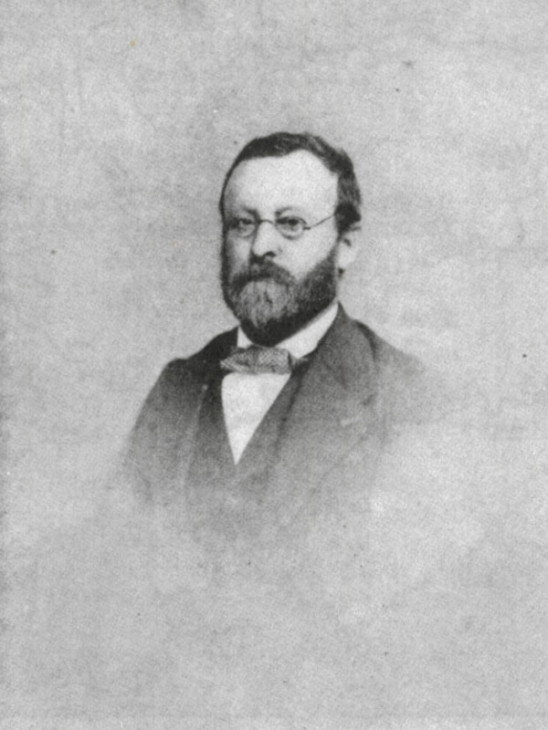

Charles Albin Mazon est un journaliste et un historien français, né à
Largentière (Ardèche) le 24 octobre 1828.

Sa famille est originaire d'Antraigues. Son père Victorin Mazon (1796-1861) est
médecin et sa mère Virginie Clément-Rouvière (1807-1836) est native de Nîmes.

Lecteur insatiable dès l'enfance d'ouvrages d'histoire, d'imagination et de
poésie, Albin Mazon est d'abord élève du "petit séminaire" de Bourg-Saint-Andéol
puis jusqu'en 1846 du collège de Privas, tenu par les Basiliens (temps dont il
gardera un souvenir ému et reconnaissant).

Il entreprend ensuite des études de médecine à Paris. Mais le docteur [Victorin
Mazon](https://1851.fr/hommes/mazon/), républicain convaincu, est compromis dans
"l'affaire de Laurac". En 1851, cela les oblige à s'exiler pour opinions
politiques, en Suisse dans un premier temps, puis dans les États de Savoie, qui
appartenaient alors au royaume de Sardaigne.

Albin Mazon doit renoncer à ses études de médecine pour trouver une situation.
Il devient journaliste, à Chambéry d'abord, puis à Nice. Rédacteur à l'Avenir de
Nice en 1855, il est un des artisans du rattachement de Nice à la France. Ses
articles, prématurément favorables à l'idée de l'annexion, le font expulser par
le gouvernement italien en 1861.

Après dix années d'éloignement, il se réfugie à Paris pour prendre la direction
des services télégraphiques de l'Agence Havas. A l'occasion du rattachement de
Nice à la France, il est décoré de la Légion d'honneur le 15 août 1862.

A sa retraite en 1890, il se consacre entièrement à l'histoire de son pays
natal, le Vivarais, devenu le département de l'Ardèche. Infatigable explorateur
et historien du département, Albin Mazon est l'auteur de nombreux ouvrages dont
treize récits de voyages en Ardèche publiés sous le pseudonyme de Docteur
Francus.

Ce nom évoque à la fois le souvenir d'une vocation médicale, le goût de
l'histoire ancienne, l'amour du pays, le franc-parler, le souci d'observer les
maux et d'y chercher remède... Tous ces éléments sont présents dans chaque
volume de la série des __Voyages du Docteur Francus__.

* [Voyage aux pays volcaniques du Vivarais](./vivarais/) (1878)
* Voyage autour de Valgorge (1879)
* [Voyage autour de Privas](./privas/) (1882)
* Voyage dans le midi de l'Ardèche (1884)
* [Voyage à pied, à bateau, en voiture et à cheval le long de la rivière d'Ardèche](./riviere-ardeche/) (1885)
* [Voyage au pays Helvien](./helvien/) (1885)
* Voyage au Bourg-Saint-Andéol (1886)
* Voyage autour de Crussol (1888)
* [Voyage humoristique, politique et philosophique au mont Pilat](./pilat/) (1890)
* Voyage fantaisiste et sérieux à travers l'Ardèche et la Haute-Loire (1894)
* [Voyage autour d'Annonay](./annonay/) (1901)
* [Voyage au pays des Boutières](./boutieres/) (1902)
* Voyage humoristique dans le Haut Vivarais (1905)

Albin Mazon est mort à Paris le 29 février 1908. Il est enterré au cimetière de
Privas où il possédait une maison, place des Mobiles, en face de la demeure de
M. Paul d'Albigny avec qui il avait fondé la
[Revue du Vivarais](http://www.revueduvivarais.fr/).

Cet érudit chercheur a fait don du fruit de son travail d'historien, constitué
de notes, lettres, coupures de presse, documents originaux... Pour Albin Mazon,
cette documentation qui va de 1184 au XX^e^ siècle, devait servir à un
dictionnaire "historique, géographique, biographique, bibliographique,
industriel et commercial" de l'Ardèche qui n'a jamais vu le jour.

Aujourd'hui numérisés et conservés aux Archives départementales, les registres
de son Encyclopédie de l'Ardèche constituent une partie substantielle du [Fonds
Albin Mazon](http://archives.ardeche.fr/Accueil/Consulter_les_archives_numerisees/mazon/Encyclopedie)
consultable en ligne.
