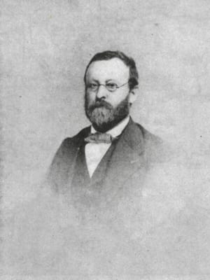

Charles Albin Mazon est un journaliste et un historien français, né à
Largentière (Ardèche) le 24 octobre 1828.

Sa famille est originaire d'Antraigues. Son père Victorin Mazon (1796-1861) est
médecin et sa mère Virginie Clément-Rouvière (1807-1836) est native de Nîmes.

Lecteur insatiable dès l'enfance d'ouvrages d'histoire, d'imagination et de
poésie, Albin Mazon est d'abord élève du "petit séminaire" de Bourg-Saint-Andéol
puis jusqu'en 1846 du collège de Privas, tenu par les Basiliens (temps dont il
gardera un souvenir ému et reconnaissant).

Il entreprend ensuite des études de médecine à Paris. Mais le docteur [Victorin
Mazon](https://1851.fr/hommes/mazon/), républicain convaincu, est compromis dans
"l'affaire de Laurac" en 1851. Cela les contraint à s'exiler en Suisse dans un
premier temps, puis dans les États de Savoie, appartenant alors au royaume de
Sardaigne.

Albin Mazon renonce à ses études de médecine pour trouver une situation. Il
devient journaliste à Chambéry puis à Nice. Rédacteur à l'Avenir de Nice en
1855, il est partisan du rattachement de Nice à la France. Ses articles,
prématurément favorables à l'idée de l'annexion, le font expulser par le
gouvernement italien en 1861.

Après dix années d'éloignement, il se réfugie à Paris où il prend la direction
des services télégraphiques de l'Agence Havas. Lors du rattachement de Nice à la
France, il est décoré de la Légion d'honneur le 15 août 1862.

A sa retraite en 1890, il se consacre entièrement à l'histoire de son pays
natal, le Vivarais, devenu le département de l'Ardèche. Infatigable explorateur
et historien du département, il est l'auteur de nombreux ouvrages dont treize
récits de voyages en Ardèche publiés sous le pseudonyme de "Docteur Francus".

Ce nom évoque à la fois le souvenir d'une vocation médicale, le goût de
l'histoire ancienne, l'amour du pays, le franc-parler, le souci d'observer les
maux et d'y chercher remède... Tous ces éléments sont présents dans chaque
volume de la série des "Voyages du Docteur Francus".
Cette oeuvre de longue haleine, entreprise à partir de 1878, avait pour ambition
de faire découvrir aux Ardéchois, région par région, la vie et l'histoire de
leur province.

* [__Voyage aux pays volcaniques du Vivarais__](./vivarais/) (1878)
* [Voyage autour de Valgorge](./valgorge/) (1879)
* [__Voyage autour de Privas__](./privas/) (1882)
* [__Voyage dans le midi de l'Ardèche__](./midi-ardeche/) (1884)
* [__Voyage à pied, à bateau, en voiture et à cheval le long de la rivière d'Ardèche__](./riviere-ardeche/) (1885)
* [__Voyage au pays Helvien__](./helvien/) (1885)
* [Voyage au Bourg-Saint-Andéol](./bourg-st-andeol/) (1886)
* [__Voyage autour de Crussol__](./crussol/) (1888)
* [__Voyage humoristique, politique et philosophique au mont Pilat__](./pilat/) (1890)
* [__Voyage fantaisiste et sérieux à travers l'Ardèche et la Haute-Loire__](./haute-loire/) (1894)
* [Voyage autour d'Annonay](./annonay/) (1901)
* [__Voyage au pays des Boutières__](./boutieres/) (1902)
* [Voyage humoristique dans le Haut Vivarais](./haut-vivarais) (1905)

Albin Mazon est mort à Paris le 29 février 1908. Il a été enterré au cimetière
de Privas où il possédait une maison, place des Mobiles, en face de la demeure
de M. Paul d'Albigny avec qui il avait fondé la
[Revue du Vivarais](http://www.revueduvivarais.fr/). Auguste Le Sourd, directeur
de la revue, a publié un article sur "[M. Mazon et son Œuvre](./albin-mazon.html)"
dans les numéros 8 et 9 de l'année 1908.

Albin Mazon a fait don du fruit de son travail d'historien, constitué de notes,
lettres, coupures de presse et documents originaux aux Archives de l'Ardèche.
Cette documentation devait servir à un dictionnaire "historique, géographique,
biographique, bibliographique, industriel et commercial" de l'Ardèche qui n'a
jamais vu le jour. Aujourd'hui numérisés, les registres de son "Encyclopédie de
l'Ardèche" constituent le [Fonds Albin Mazon](https://archives.ardeche.fr/n/fonds-mazon/n:103).

Les Voyages du Docteur Francus ont été publiés du vivant d'Albin Mazon de 1878 à
1905. Ils ont été réédités à partir des années 1965  par l'Imprimerie Lienhart à
Aubenas, les Editions Simone Sudre du Teil et les Editions de Candide à
Lavilledieu. Après 1990, certains titres ont à nouveau été réédités par les
Editions Dolmazon du Cheylard et La Bouquinerie à Valence.

Depuis 2016, l'objectif de ce site est de continuer le travail de diffusion de
ces récits de voyage. J'espère qu'avec cette édition de nouveaux lecteurs
découvriront ces témoignages du patrimoine ardéchois.

A travers ce média moderne, les lecteurs et les historiens locaux accèderont
plus facilement à cette somme de connaissance du terroir ardéchois qui fut
l'oeuvre de la vie d'Albin Mazon. Tous les amis de l'Ardèche et du Vivarais
pourront ainsi consulter librement la collection complète des Voyages du Docteur
Francus.

Michel

